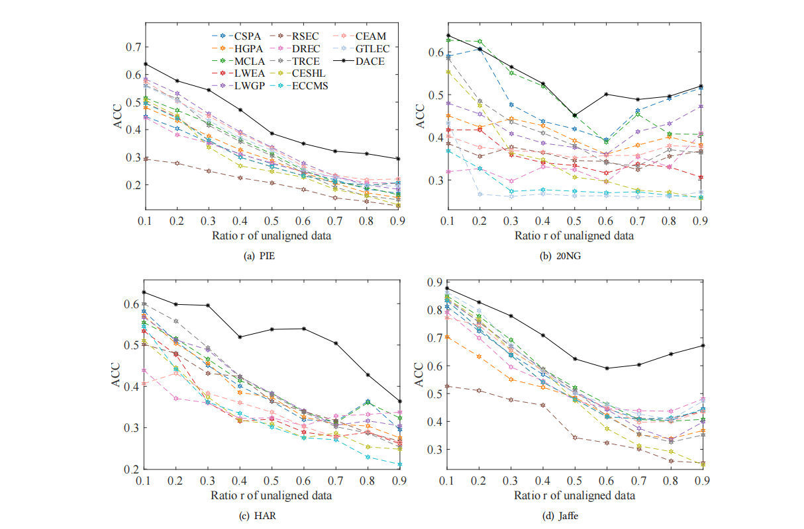
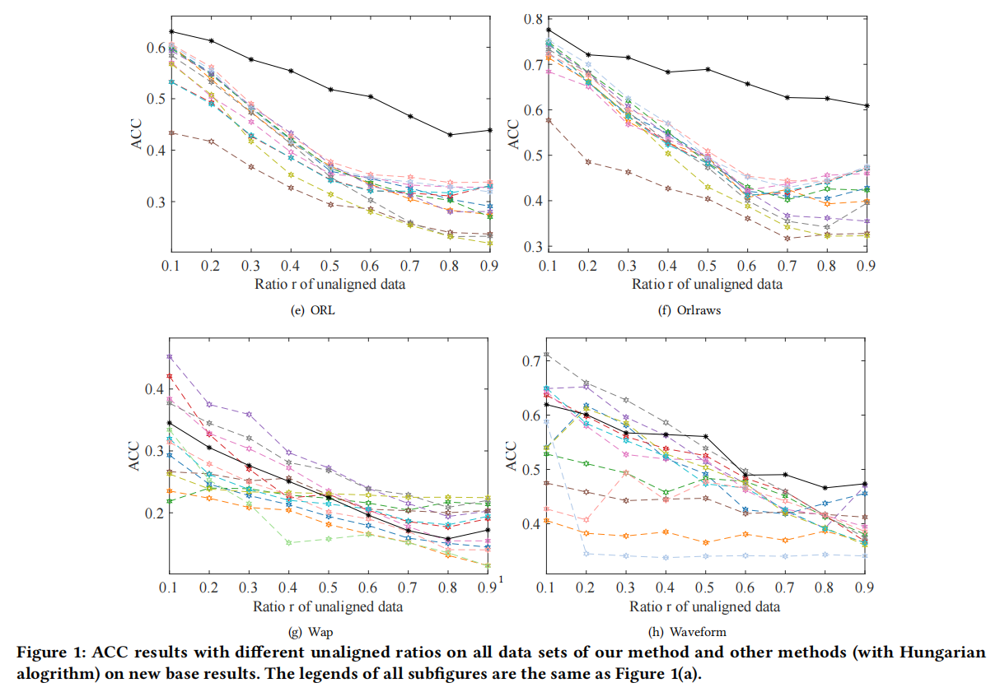
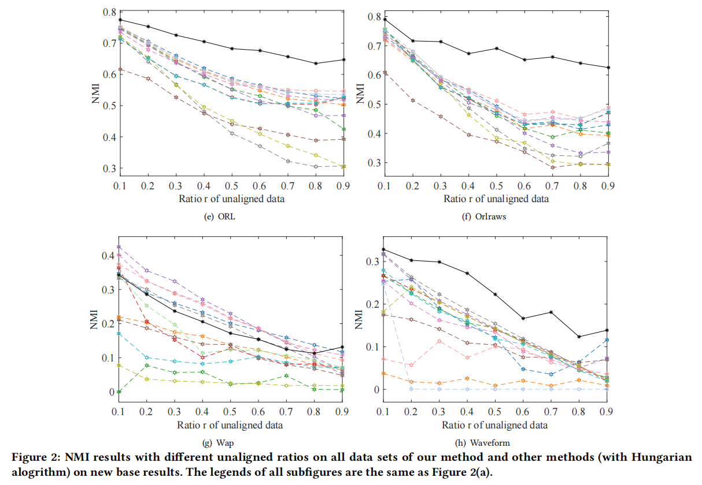

**W2 & Q2 of Reviewer MKUj:**

We generate 10 new base results, including three kmeans methods, three spectral clustering methods, three hierarchical clustering methods, and one Gaussian mixed model, which considers the diversity. Then, we conduct the comparison experiments on these new base results. Figures 1 and 2 show the ACC and NMI of all methods on all data sets. We can see that our method outperforms other methods on most data sets. On Wap data set, our method performs worse than other methods. It can be seen that the start point of our method is lower than other methods, leading to the lower performance on each ratio. However, the slope of our method is similar to that of other methods, which means we have a comparable rate of decline in performance compared to other methods on Wap. It shows that the our effectiveness of handling unaligned data is comparable with other methods on Wap data set. 

The comparison experiments results are shown in "Anonymous.pdf".

The content of the image below is consistent with the content of the document "Anonymous.pdf".

